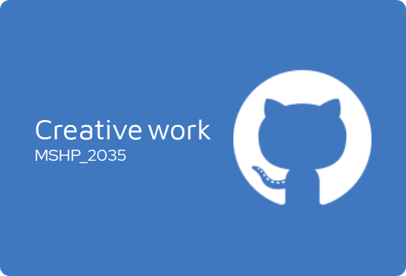

# 🎉 Welcome to MSHP_2035 Creative Work Project 🎉 

This is a project created as part of the MSHP_2035 course and it's the first creative work of the course. The purpose of this project is to demonstrate creativity and showcase the skills learned throughout the course. 

## 🚀 Project Overview 🚀

The project is an application that showcases the creative capabilities of the developer. It includes a unique and user-friendly design that enhances the user experience. The application also provides some unique features that you may not find in other applications. 

## 🎨 Project Style 🎨

The app is designed with modern and elegant styles that bring a unique feel to the user. Colors, fonts, images, and icons are carefully selected to ensure visual harmony throughout the application. A user can feel the visual appeal of the app and enjoy using it. 

### Thank you for checking out my project!
